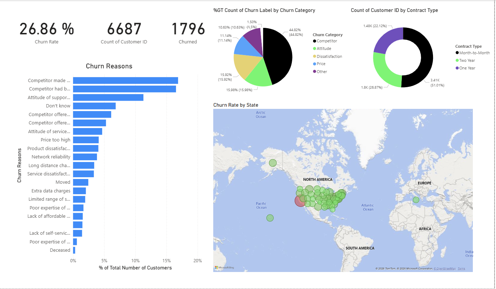
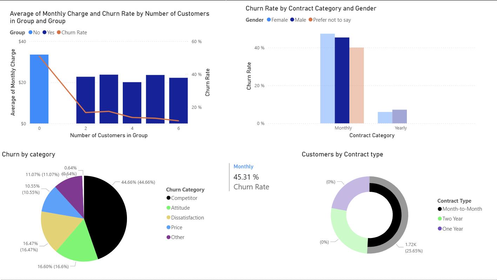
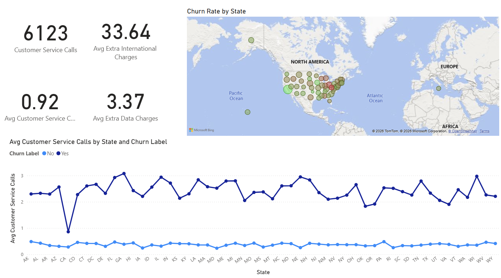

# 📊 Customer Churn Analysis (Power BI)

## 📌 Project Overview

This project analyses customer churn behaviour for a subscription-based telecom company.  

The objective was to identify key drivers of churn, quantify revenue risk, and provide data-driven recommendations to improve customer retention.

The analysis was conducted using Power BI with structured data modelling and reusable DAX measures.

---

## 🧠 Business Problem

Customer churn significantly impacts recurring revenue and long-term profitability.

The business sought to understand:

- What is the overall churn rate?
- Which customer segments exhibit higher churn behaviour?
- Do customer service interactions and additional charges influence churn?
- How can churn risk be reduced?

---

## 🧮 Analytical Approach

The analysis involved:

- Building a clean data model in Power BI
- Creating a dedicated `_Measures` table to centralise KPI logic
- Developing reusable DAX measures for churn and customer behaviour metrics
- Segmenting churn across demographics, contract type, and service usage
- Designing interactive dashboard pages for executive decision-making

---

## 📊 DAX Measures Created

Key measures developed include:

- `Number of Customers`
- `Number of Unique Customers` (data validation check)
- `Number of Churned Customers`
- `Churn Rate`
- `Avg Customer Service Calls`
- `Avg Extra Charges`
- `Avg Extra International Charges`

Example DAX logic:

```DAX
Churn Rate = 
DIVIDE(
    [Number of Churned Customers],
    [Number of Customers]
)
```

Measures were designed to dynamically adjust across filter contexts, enabling accurate segmentation analysis.

---

## 📊 Dashboard Overview

### Executive Overview



Provides high-level KPIs including churn rate and customer metrics.

---

### Segmentation Analysis


Breaks down churn behaviour across demographic and behavioural variables.

---

### Interactive Exploration



Demonstrates cross-filtering and slicer functionality, allowing dynamic exploration of churn drivers.

---

### Key Insights



Analysis revealed:

- Higher churn among customers with elevated service call frequency
- Increased churn correlated with additional service charges
- Behavioural indicators provided stronger churn signals than basic demographics alone

---

## 🔎 Key Findings

- Customer service interactions and extra charges were meaningful churn indicators
- Segment-level analysis enables targeted retention interventions
- Data validation using unique customer counts ensured analytical accuracy

---

## 🛠 Skills Demonstrated

- Power BI dashboard development  
- DAX measure engineering  
- Context-aware KPI calculation  
- Data validation and quality control  
- Segmentation and behavioural analysis  
- Business-focused data storytelling  

---

## 📁 Repository Structure

```
customer-churn-analysis/
│
├── data/
│   └── dataset.csv
├── powerbi/
│   └── dashboard.pbix
├── images/
│   ├── overview.png
│   ├── measures.png
│   ├── segmentation.png
│   ├── interaction.png
│   └── insight.png
└── README.md
```

---

## 🚀 Outcome

This project demonstrates the ability to transform raw customer data into structured churn insights using DAX, data modelling, and interactive dashboard design.

The final output enables business stakeholders to identify at-risk segments and prioritise retention strategies.
